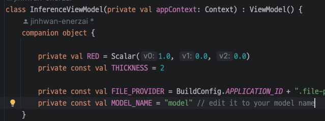
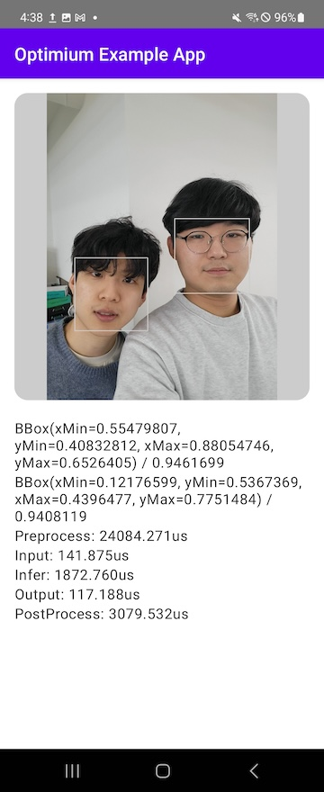

# Optimium Runtime Android Example App

This example describes how to run face detection model on your Android device with Optimium.

> This example assumes your Android device runs on ARM64(AArch64, armv8-a) architecture CPU.

## How to build

1. Copy the model into your working directory. The model file (`face_detection_short_range.tflite`) is in the `Models` folder of the repository.
2. Optimize the model using Optimium.
    ``` bash
    # Create a template
    $OPTIMIUM_SDK_ROOT/run_optimium.sh --working_dir $YOUR_WORKING_DIR --create_template

    # edit your user_arguments.json: "YOUR_MODEL.tflite" to "face_detection_short_range.tflite"

    # Optimize the model
    $OPTIMIUM_SDK_ROOT/run_optimium.sh --working_dir $YOUR_WORKING_DIR
    ```
3. Copy optimized model folder (NOT contents of the model folder) into `src/main/assets` folder.
    ``` bash
    $YOUR_WORKING_DIR/outputs/{device_name}-{num_thread}-{opt_log_key}/{out_dirname}/ src/main/assets
    ```
4. Open `Android` folder with Android Studio and edit model name in `src/main/com/enerzai/optimium/example/android/InferenceViewModel.kt`.
    
5. Build and run the app.

## Run on real devices

Run on Samsung Galaxy Fold 2

