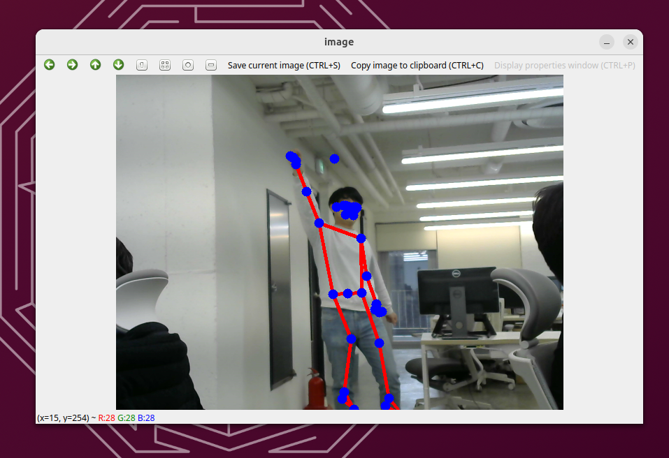

# Optimium Runtime C++ Example App

This example describes how to run face detection model on Linux with Optimium.

> This example assumes your target device is X64(AMD64, x86_64) architecture CPU.

## How to build

> This examples requires a camera device to capture  an image.

1. Install prerequisites.
    ``` bash
    sudo apt install build-essential cmake libopencv-dev
    ```

1. Copy the model into your working directory. The model file (`pose_landmark_lite.tflite`) is in the `Models` folder of the repository.

1. Optimize the model using Optimium.
    ``` bash
    # Create a template
    $OPTIMIUM_SDK_ROOT/run_optimium.sh --working_dir workdir --create_template

    # edit your user_arguments.json: "YOUR_MODEL.tflite" to "pose_landmark_lite.tflite"

    # Optimize the model
    $OPTIMIUM_SDK_ROOT/run_optimium.sh --working_dir workdir
    ```

1. Open `Cpp` folder on the terminal and type commands below to build.
    ``` bash
    cmake -B build -S .
    cmake --build build --target all
    ```

1. Run the app.
    ``` bash
    build/optimium-cpp "workdir/.../pose_landmark_lite"
    ```

## Run on real devices

Linux desktop (Ubuntu 23.04)

